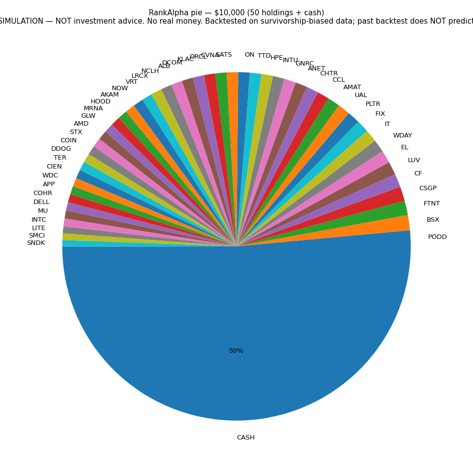
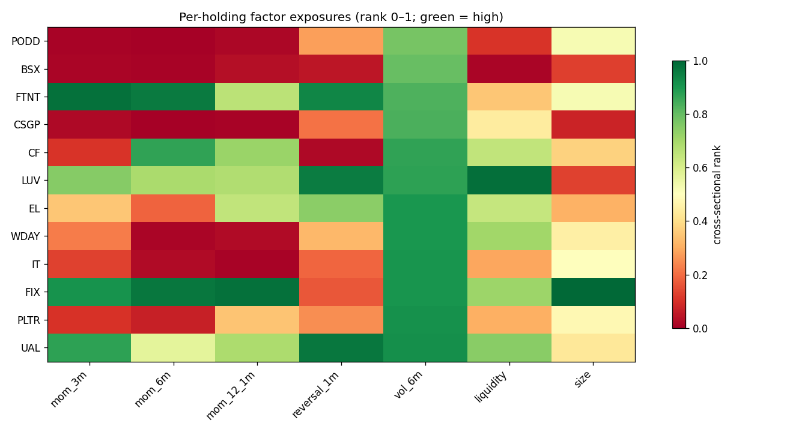
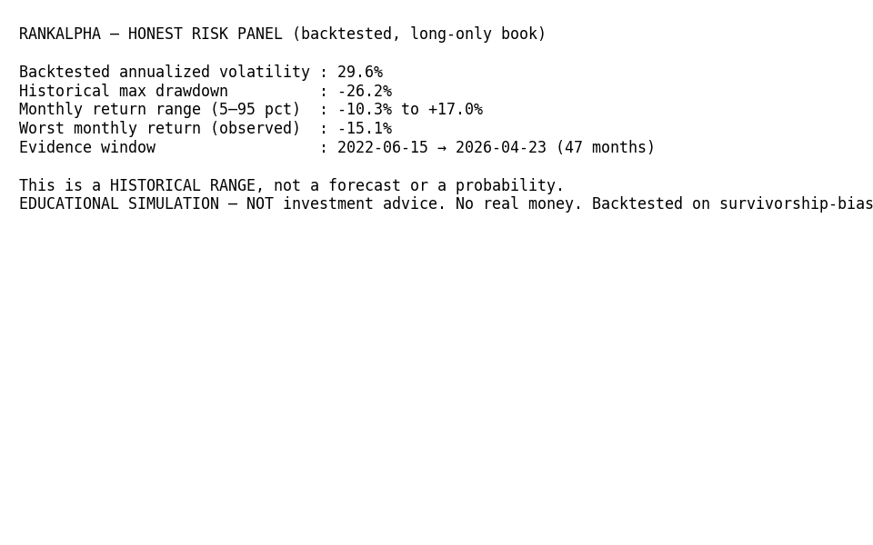
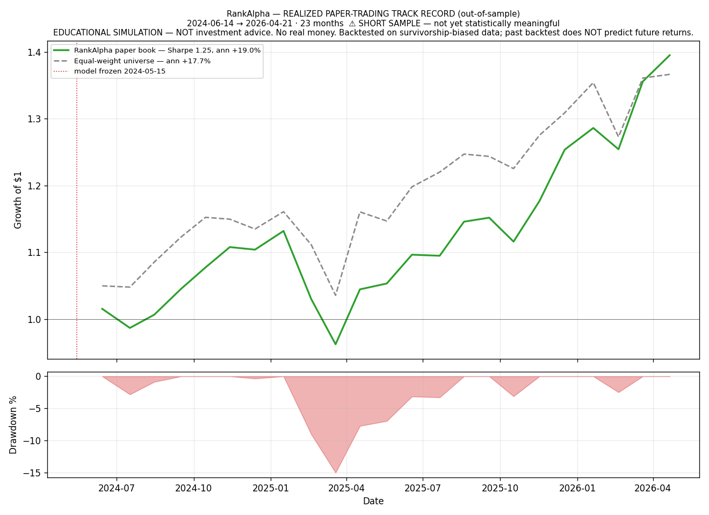

# RankAlpha

### ▶️ **[Try the live demo](https://financeai-tqrpxdxbsnqcfvrtko5one.streamlit.app/)** — no install, runs in your browser

**A transparent, leakage-controlled cross-sectional equity ranker for the S&P 500 — with an
honest, self-explaining portfolio product on top.** A LightGBM LambdaMART model ranks the
cross-section each month; a research backtest trades the tails long/short; and a long-only
**demo product** turns the scores into a risk-managed "pie" that explains every holding. Runs
on a single Linux laptop — no cloud required.

> ⚠️ **EDUCATIONAL SIMULATION — NOT investment advice. No real money. Past results do NOT
> predict future returns.** Backtested on a survivorship-biased universe. This is a
> *methodology demonstration*, not a deployable strategy. Read [LIMITATIONS.md](LIMITATIONS.md)
> before trusting any number below.

[](https://financeai-tqrpxdxbsnqcfvrtko5one.streamlit.app/)


---

## What it is

RankAlpha treats ML as a **scoring function for ranking**, not a price/direction predictor. The
model learns to order the S&P 500 cross-section by forward-return rank each month; the portfolio
is built from those ranks with classical, transparent rules (inverse-volatility sizing, position
caps, volatility targeting). The selling point is **honesty**: leakage-controlled validation,
SHAP reasons on every holding, a risk panel that shows historical ranges (never forecasts), and
a forward paper-trading track kept strictly separate from the in-sample backtest.

## Headline results

**Research backtest** — out-of-sample 2022-06 → 2026-05, after 10 bps/side, 47 monthly rebalances:

| Metric | LightGBM ranker | 12-1 momentum baseline |
|---|---|---|
| After-cost Sharpe | **1.14** | 0.82 |
| Mean Rank IC | **0.050** (t = 1.64) | 0.041 |
| Edge survives costs to | **30 bps/side** | — |

The ranker's dominant feature is **6-month volatility** (~60% importance; SHAP agrees), blended
with size — a genuine multi-factor edge, not re-derived momentum. Per-holding SHAP shows the long
book tilts toward **higher-volatility** names (importance ≠ direction — this is *not* a low-vol
anomaly).

**Forward paper-trading track** — model frozen 2024-05-15, traded forward 23 months (never refit):

| | Paper book | Equal-weight universe |
|---|---|---|
| Annualized return | +19.0% | +17.7% |
| Annualized vol (realized) | 14.8% | 14.3% |
| Sharpe (rf=0) | 1.25 | 1.21 |
| Max drawdown | −15.0% | −10.8% |

A modest, honest edge — explicitly flagged as **too short (23 months) to be statistically
meaningful**. ⚠️ All absolute levels are **survivorship-inflated**; the *relative* (model vs
baseline / benchmark, same universe) comparison is the trustworthy one. Full caveats:
[LIMITATIONS.md](LIMITATIONS.md).

## The demo product

```bash
streamlit run app.py
```

Enter an amount and a risk level (**Conservative ≈ 10% vol / Balanced ≈ 14% / Aggressive ≈ 20%**).
The risk slider updates the **invested-vs-cash** split live (higher target → more invested, never
levered). Two tabs: **Build a pie** and the forward **Track record**.

| Allocation pie | Per-holding factor exposures | Honest risk panel |
|---|---|---|
|  |  |  |

**Paper-trading track record** (realized, out-of-sample — *not* the backtest, *not* a forecast):



- **LLM explainer (3 backends, same guardrail):** the holdings explanation defaults to a
  **deterministic template** (instant, equally factual) so the app never hangs or hard-depends on
  an LLM. Backend priority: **Groq** if `GROQ_API_KEY` is set (the hosted path) → **local Ollama
  `phi3:mini`** if `USE_LLM=1` (`ollama serve` + `ollama pull phi3:mini`) → template. Every backend
  is fed **only** the model's real factor/SHAP reasons + stats and is instructed never to predict,
  advise, or invent numbers; any LLM failure falls back to the template.
- **Speed:** the fitted book is cached to disk (`joblib`, `data/cache/`), so only the *first* run
  fits the model (~80 s); every run after loads in ~1 s. The **hosted** build skips fitting entirely
  by loading a committed precomputed bundle (see below).

## Hosted public demo (Streamlit Community Cloud)

🔗 **Live:** https://financeai-tqrpxdxbsnqcfvrtko5one.streamlit.app/

The app ships a **clickable public demo** — no clone, no data download. A free host has none
of the gitignored `data/` parquets and can't run a local LLM, so v1.1 makes two swaps:

- **Precomputed bundle (the data problem).** Instead of refitting the model or downloading 500
  tickers on boot, the hosted app loads a small **committed bundle** in `portfolio/bundle/`:
  the frozen fitted long book (`score_book.joblib`, ~24 KB — exactly what `finalize_portfolio`
  needs: holdings, capped weights, book vol, per-holding SHAP explanations, OOS risk stats) plus
  the realized paper-track ledger (~58 KB). **Total ≈ 80 KB** — the 131 MB of source parquets stay
  gitignored and never reach the host. When `data/` is absent the engine serves the bundle
  automatically (`score_book` / `load_track` fall back to it); first visit renders a pie with **no
  manual data step**. Regenerate the bundle after refreshing data with `python -m portfolio.make_bundle`.
- **Groq instead of Ollama.** With `GROQ_API_KEY` set as a Streamlit secret, the explainer uses
  Groq — same prompt, same explain-only guardrail, same template fallback. The key lives only in
  Streamlit secrets / env and is **never committed**.

All the honesty survives on the hosted build: the red educational-simulation banner top **and**
bottom, the "historical, not a forecast" risk labels, and the small-sample caveat on the track tab.

**Deploy steps** (≈ 2 minutes):

1. Push this repo to a **public GitHub** repository.
2. Go to **[share.streamlit.io](https://share.streamlit.io)** → **Create app** → **Deploy a public
   app from GitHub** and connect the repo.
3. Set **Main file path** to `app.py` (branch `main`, Python 3.10+).
4. Open **Advanced settings ▸ Secrets** and paste:
   ```toml
   GROQ_API_KEY = "gsk_your_key_here"
   ```
   (free key at [console.groq.com/keys](https://console.groq.com/keys); omit it and the app runs
   on the deterministic template). See [`.streamlit/secrets.toml.example`](.streamlit/secrets.toml.example).
5. Click **Deploy**. First boot loads the bundle in ~1 s and serves the pie.

> Alt host: **Hugging Face Spaces** (Streamlit SDK) works the same way — point it at `app.py` and
> add `GROQ_API_KEY` as a Space secret.

## How it works

```
utils/  (data)            signals/  (model)                portfolio/  (product)
─────────────────         ────────────────────────         ──────────────────────────
sp500_data.py     ──▶  baseline_momentum.py  ──┐      ┌─▶ engine.py        build_portfolio()
  S&P500 panel          no-ML 12-1 momentum     │      │     long-only, inverse-vol,
sp500_features.py       (the bar to beat)       │      │     position-cap, vol-target
  7 PIT rank feats   lgbm_ranker.py  ───────────┼──────┤  llm_explainer.py  plain-English
sp500_labels.py         LambdaMART, walk-forward│      │     (template / Ollama / Groq)
  fwd-return ranks      + 21d embargo           │      └─▶ paper_trade.py   frozen-model
                     evaluate.py  ──────────────┘            forward track (update_track)
                        honest OOS eval
```

- **Data** — `utils/sp500_data.py` builds a ~7-year daily OHLCV panel of current constituents;
  `sp500_features.py` computes 7 point-in-time, within-day rank features (3/6/12-month return,
  1-month reversal, 6-month vol, liquidity surge, size proxy); `sp500_labels.py` makes
  forward-return rank/decile labels (21-day horizon).
- **Signals** — `baseline_momentum.py` is the no-ML 12-1 momentum baseline the model must beat.
  `lgbm_ranker.py` trains an `LGBMRanker` (LambdaMART) with **expanding-window walk-forward
  validation and a 21-day embargo** — no shuffling, no global fit, no leakage. `evaluate.py` is
  the honest OOS evaluation (Rank IC, decile monotonicity, after-cost Sharpe, drawdown vs baseline).
- **Portfolio** — `engine.py` turns frozen-model scores into the long-only product book.
  `paper_trade.py` freezes the model once and trades it forward, marking to realized returns.

## Quickstart

```bash
python -m venv venv && source venv/bin/activate
pip install -r requirements.txt

# 1) Build the dataset (downloads prices; data/ is gitignored and regenerated locally)
python -m utils.sp500_data        # → data/sp500_panel.parquet
python -m utils.sp500_features    # → data/sp500_features.parquet
python -m utils.sp500_labels      # → data/sp500_labeled.parquet

# 2) Reproduce the research results
python -m signals.baseline_momentum   # no-ML baseline
python -m signals.lgbm_ranker         # ranker vs baseline (walk-forward)
python -m signals.evaluate            # honest OOS evaluation

# 3) Build the forward paper-trading track record (one model fit, then idempotent)
python -m portfolio.paper_trade

# 4) Launch the demo product (local: template by default; USE_LLM=1 for local Ollama)
streamlit run app.py

# 5) (optional) Refresh the committed hosted-demo bundle after regenerating data
python -m portfolio.make_bundle   # → portfolio/bundle/ (frozen book + paper-track ledger)
```

`portfolio.paper_trade.update_track()` is **idempotent** — re-running appends only newly-due
months. All generated data lives in gitignored `data/`; figures are committed under `figures/`.

## Project structure

```
financeai/
├── app.py                       # Streamlit demo product (Build-a-pie + Track-record tabs)
├── utils/
│   ├── sp500_data.py            # build the S&P 500 OHLCV panel
│   ├── sp500_features.py        # 7 point-in-time within-day rank features
│   └── sp500_labels.py          # forward-return rank / decile labels (21d)
├── signals/
│   ├── baseline_momentum.py     # no-ML 12-1 momentum baseline (the bar to beat)
│   ├── lgbm_ranker.py           # LGBMRanker LambdaMART, walk-forward + 21d embargo
│   └── evaluate.py              # honest out-of-sample evaluation
├── portfolio/
│   ├── engine.py                # build_portfolio(): long-only, inverse-vol, vol-target
│   ├── llm_explainer.py         # plain-English explainer (template / Ollama / Groq)
│   ├── paper_trade.py           # frozen-model forward paper-trading track record
│   ├── make_bundle.py           # regenerate the committed hosted-demo bundle
│   └── bundle/                  # committed ~80 KB hosted bundle (frozen book + track)
├── analytics/                   # model-agnostic performance analyser (metrics, charts)
├── lab/
│   ├── strategy_lab.py          # survival-chain A/B harness (equal-weight factor combine)
│   └── value_factor.py          # #18 value composite on point-in-time fundamentals
├── audit/
│   ├── fundamentals.py          # #17 seven-check data-quality gate + GO/NO-GO
│   └── sec_provider.py          # SEC EDGAR XBRL point-in-time fundamentals client
├── universe.py                  # #16 mid+large-cap universe builder (SEC + liquidity screen)
├── scripts/                     # CLIs: analyse, strategy_lab, audit_fundamentals,
│                                #       value_factor, expand_universe, regime_stress_test
├── .streamlit/                  # secrets.toml.example (Groq key for the hosted deploy)
├── figures/                     # committed output figures + reports (audit/, lab/)
├── CONCEPT.md · ROADMAP.md · LIMITATIONS.md
├── requirements.txt · LICENSE · README.md · Makefile
```

## Research track (Phases 12–18)

Post-ship experiments, each gated on the last. The frozen model is never refit — factors are
combined by equal-weight percentile rank so any change is attributable to the factor itself.

| # | Experiment | Verdict |
|---|---|---|
| 14 | Low-volatility factor | **KEEP** — at matched vol, same return, half the drawdown |
| 15 | Beta-targeted pie engine | Shipped — hits target beta by construction; impossible targets are capped, not faked |
| 16 | Universe → US mid+large cap, 1,200 names (>$2B), model retrained | Pipeline retrains cleanly, **headline number rejected** — Sharpe up (1.14→1.81) but Rank IC *down* (0.0505→0.0276) |
| 17 | Fundamentals data audit (SEC EDGAR XBRL) | **GO** — 19,513 records, 100% point-in-time, ≤2.5% cross-source discrepancy |
| 18 | Value factor (E/P + B/M + EBITDA/EV + FCF yield) | **DROP** — uncorrelated with momentum (−0.15…−0.20) but Sharpe falls in every window |

Two results worth reading:

- **#18** — an independent signal that costs risk-adjusted return is still a worse
  portfolio. *Uncorrelated* is necessary, not sufficient.
- **#16** — the wider universe produced a much better-looking Sharpe and a *worse* Rank IC.
  Payoff up, ranking skill down is the fingerprint of survivorship-**inclusion** bias
  (2019's future ten-baggers are in the panel from day one because they clear a *today's*
  $2B screen), so the number was rejected rather than banked. The S&P 500 model remains the
  shipped one.

```bash
make audit      # #17 — regenerate the GO/NO-GO data-quality report (needs network)
make value      # #18 — value factor A/B (refuses to run unless #17 says GO)
make universe   # #16 — build the wider universe, retrain, report (needs network, slow)
make test-all   # every unit-test suite
```

## Methodology & honesty

- **[CONCEPT.md](CONCEPT.md)** — the why: ranking vs prediction, the factor design, the thesis.
- **[ROADMAP.md](ROADMAP.md)** — the locked, gated 10-phase plan (Phases 1–9 complete).
- **[LIMITATIONS.md](LIMITATIONS.md)** — the honest account: survivorship bias, weak size/liquidity
  proxies, sample too small for significance (t < 2), untested through a momentum crash,
  long-concentrated and volatility-driven edge. **What we can and cannot claim.**

## What this project demonstrates

- **Leakage-controlled ML for finance** — expanding-window walk-forward, per-fold embargo,
  point-in-time features, no global fit. The validation is the hard part, and it's done right.
- **Learning-to-rank** (LambdaMART) applied to cross-sectional equity selection.
- **Explainability end-to-end** — SHAP attributions surfaced as plain-English per-holding reasons.
- **Honest evaluation & risk communication** — beats a real baseline on the same window, reports
  historical ranges (never forecasts), and separates a forward paper-trade from the backtest.
- **Pragmatic engineering** — on-disk model caching, idempotent ledger updates, a graceful
  template fallback so the app never hangs on constrained hardware, and a one-click public deploy
  via an ~80 KB precomputed bundle (no refit, no 500-ticker download) + a hosted Groq LLM backend.

## Disclaimer

For **educational and research purposes only**. Not financial advice. The model's past
(survivorship-biased, statistically insignificant) results do not indicate future results. Never
make investment decisions based on algorithmic output.

## License

MIT — see [LICENSE](LICENSE).

---

Built by [Priyansh Patel](https://github.com/PRIYANSH29-boop) — building at the intersection of
finance and AI.
