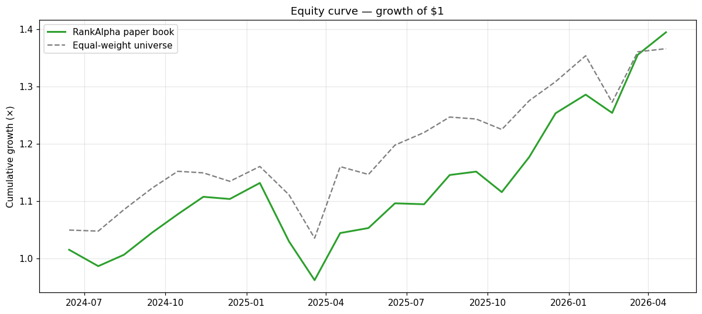
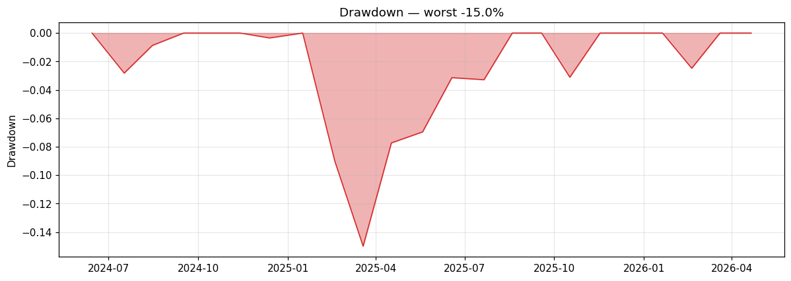
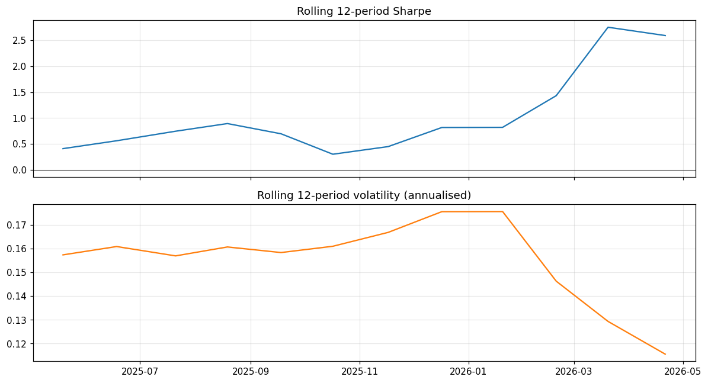
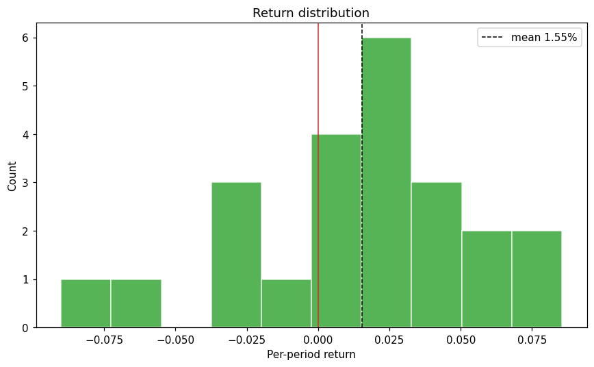
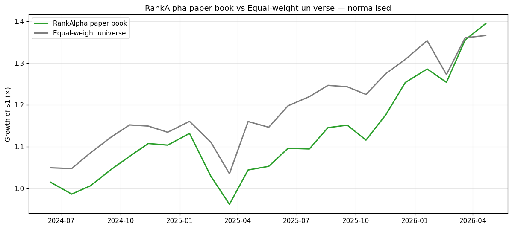

# RankAlpha — analyser scorecard (forward paper track)

*Auto-generated by `scripts/analyse.py` (Phase 13). Educational SIMULATION only — regenerated from committed data, no refit, no network.*

Model frozen **2024-05-15**, traded forward **23 months**, never refit. Benchmark is the **equal-weight investable universe** recorded alongside the book (`bench_ret`), NOT SPY — matching how the paper track defines its benchmark. Alpha/beta are reported together and are only meaningful against this benchmark.

| Metric | Paper book | Equal-weight universe |
|---|---|---|
| Total return | 39.48% | 36.62% |
| CAGR (annualised) | 18.96% | 17.68% |
| Volatility (annualised, ddof=0) | 14.51% | 14.02% |
| Sharpe (rf=0, ddof=0) | 1.28 | 1.24 |
| Sortino (rf=0, ddof=0) | 1.79 | 2.05 |
| Max drawdown | -14.99% | -10.79% |
| Max drawdown duration (months) | 6 | 4 |
| Hit rate (positive months) | 69.57% | 60.87% |
| Beta (vs equal-weight universe) | 0.87 | 1.00 |
| Alpha (annualised) | 3.38% | 0.00% |

## Reconciliation with the prior eval

The analyser uses **population** std (ddof=0) so its hand-check `vol([+12%,−8%,+4%,+8%]) = 7.48%` holds; `portfolio/paper_trade.py` and the README table use **sample** std (ddof=1). The two differ only by the n vs n−1 factor √((n−1)/n) = √(22/23) = 0.9780:

* Book Sharpe: 1.28 (ddof=0) × 0.9780 = **1.25** ≈ README **1.25** ✅
* Benchmark Sharpe: 1.24 (ddof=0) × 0.9780 = **1.21** ≈ README **1.21** ✅

Same numbers, different std convention — both trustworthy.

## Caveats

* **Survivorship-inflated:** absolute levels are not point-in-time; trust the *relative* (book vs same-universe benchmark) comparison, not the absolute Sharpe.
* **Too short:** 23 months is not statistically meaningful. No Sharpe-flexing.

## Charts

