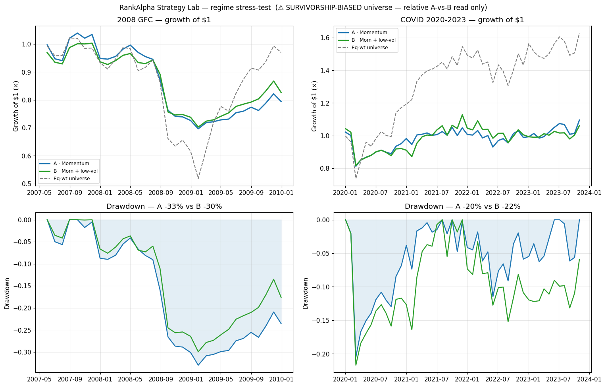

# Strategy Lab — regime stress-test (2008 GFC + COVID)

*Auto-generated by `scripts/regime_stress_test.py`. Educational SIMULATION only. Model frozen; factor-only change through the same book pipeline.*

> ⚠️ **SURVIVORSHIP BIAS (dominant caveat).** Universe = today's S&P 500 names with pre-2007 history; bankrupt/delisted firms (Lehman, Bear Stearns, WaMu, old GM, …) are absent. Absolute crash levels are optimistic and drawdowns understated. Only the **relative A-vs-B** read is trustworthy. **DIRECTIONAL, not a verdict.**

## 2008 GFC (2007-06-01 → 2009-12-31)

32 monthly rebalances · 407 survivor names · mom↔low-vol rank corr +0.20

| Metric | A · Momentum | B · Momentum + low-vol | Eq-wt universe |
|---|---|---|---|
| Total return | -20.6% | -17.3% | -3.0% |
| CAGR | -8.3% | -6.9% | -1.1% |
| Volatility (ann) | 13.6% | 13.5% | 27.6% |
| Sharpe | -0.56 | -0.46 | 0.10 |
| Sortino | -0.67 | -0.47 | 0.13 |
| Max drawdown | -33.0% | -30.0% | -49.3% |
| Hit rate | 46.9% | 56.2% | 50.0% |
| Beta | 0.38 | 0.39 | 1.00 |
| Avg turnover/rebal | 0.41 | 0.49 | — |

Low-vol **helped** on drawdown here: A -33.0% → B -30.0% (+3.0 pp).

## COVID 2020-2023 (2020-01-01 → 2023-12-31)

47 monthly rebalances · 407 survivor names · mom↔low-vol rank corr +0.10

| Metric | A · Momentum | B · Momentum + low-vol | Eq-wt universe |
|---|---|---|---|
| Total return | +9.5% | +6.1% | +62.9% |
| CAGR | +2.4% | +1.5% | +13.3% |
| Volatility (ann) | 15.0% | 16.3% | 22.6% |
| Sharpe | 0.23 | 0.18 | 0.67 |
| Sortino | 0.25 | 0.20 | 0.90 |
| Max drawdown | -20.5% | -21.7% | -26.1% |
| Hit rate | 63.8% | 57.4% | 57.4% |
| Beta | 0.57 | 0.58 | 1.00 |
| Avg turnover/rebal | 0.48 | 0.52 | — |

Low-vol **hurt** on drawdown here: A -20.5% → B -21.7% (-1.2 pp).

## Read

- **2008 GFC — low-vol helped.** Shallower drawdown, less-bad Sharpe, higher hit rate: the defensive tilt earns its keep in a slow, grinding bear.
- **COVID — low-vol slightly hurt.** A fast V-crash (Feb–Mar 2020) that monthly rebalancing can't dodge, followed by a high-beta recovery that punishes low-vol names, is the factor's worst case.
- **Both regimes:** the momentum books badly lagged the equal-weight universe — the classic *momentum crash* (missing the sharp 2009 and 2020–21 rebounds). That's a momentum limitation, not a low-vol one.

**Net:** low-vol's drawdown protection is **regime-dependent** — real in prolonged selloffs, but it can reverse in sharp V-shaped, high-vol-led recoveries. A slow-bear defense, not a universal drawdown fix. This tempers the 2024–2026 result, where it looked unambiguously protective.

