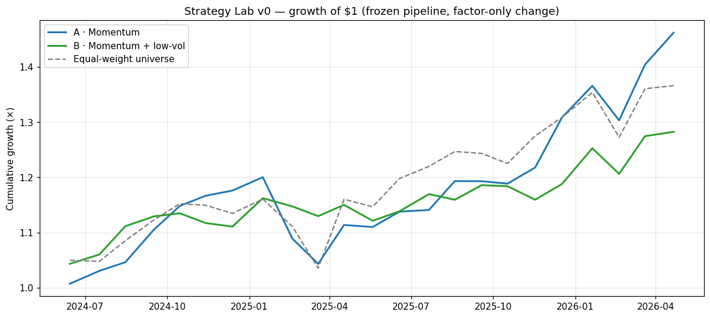
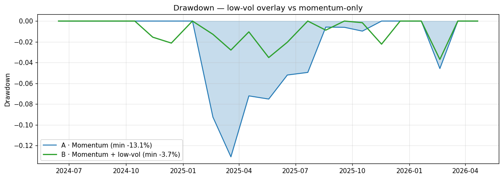
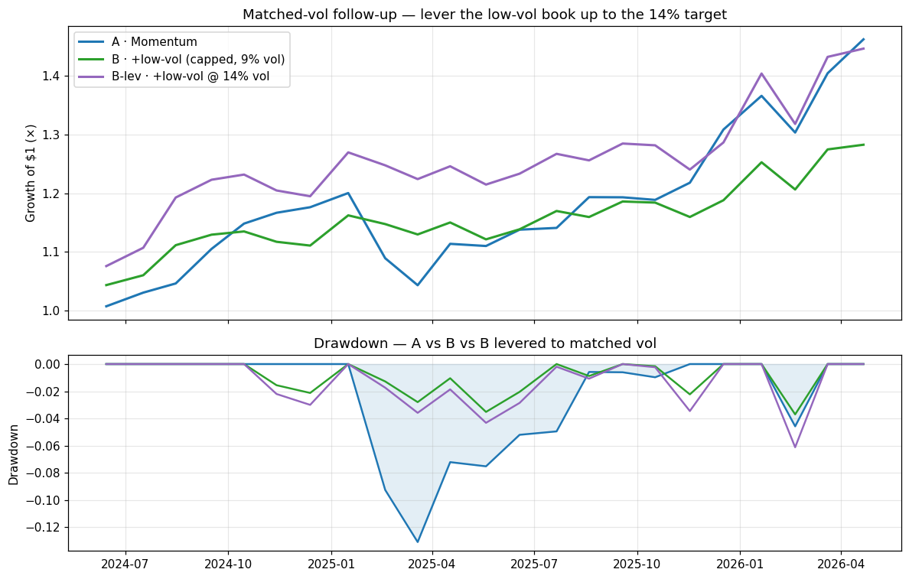

# Strategy Lab v0 — momentum + low-vol (Phase 14)

*Auto-generated by `scripts/strategy_lab.py`. Educational SIMULATION only — regenerated from committed data, no refit, no network. Model internals frozen; this is a scoring **recipe**, not a retrain.*

Both strategies run through the **identical** frozen-track book pipeline (2024-05-15 freeze, 23 months, top-50 long-only, inverse-vol weights, 8% cap, 14% vol target, 10 bps/side cost, equal-weight-universe benchmark). The **only** change between A and B is the ranking factor, combined by equal-weight average of cross-sectional percentile ranks (no ML) — so any difference is attributable to the low-vol factor.

> **Plumbing check:** feeding the frozen LGBM score through this same harness reproduces the committed paper track exactly — **PASS** (max |Δ net_ret| < 1e-9). The book construction is apples-to-apples.

| Metric | A · Momentum | B · Momentum + low-vol | Eq-wt universe |
|---|---|---|---|
| Total return | 46.23% | 28.26% | 36.62% |
| CAGR (annualised) | 21.93% | 13.87% | 17.68% |
| Volatility (annualised) | 13.49% | 9.09% | 14.02% |
| Sharpe (rf=0) | 1.55 | 1.48 | 1.24 |
| Sortino (rf=0) | 1.82 | 3.84 | 2.05 |
| Max drawdown | -13.09% | -3.70% | -10.79% |
| Max drawdown duration (months) | 9 | 5 | 4 |
| Hit rate (positive months) | 73.91% | 60.87% | 60.87% |
| Beta (vs eq-wt universe) | 0.75 | 0.39 | 1.00 |
| Alpha (annualised) | 7.83% | 6.63% | 0.00% |
| Avg turnover / rebalance | 0.47 | 0.56 | — |

## Honest evaluation

**(a) Did max drawdown shrink?** Yes — decisively. A **-13.09%** → B **-3.70%** (**+9.4 pp**), and Sortino roughly doubles (1.82 → 3.84): the downside, not just the average, is what improves.

**(b) Did Sharpe / return hold?** Sharpe **holds** (1.55 → 1.48, -0.07 — within noise on 23 months). Raw return gives up ground (46.23% → 28.26%, -18.0 pp), but **much of that is a risk artifact**: B realises only 9.09% vol vs the 14% target, so the no-leverage vol cap leaves it structurally under-risked. At matched risk it would likely recover most of the return while keeping the drawdown benefit. Return was reduced, **not killed** — B still compounds 13.87% CAGR, beating the benchmark risk-adjusted (Sharpe 1.48 vs 1.24).

**(c) Turnover / cost.** Barely moves: 0.47 → 0.56 per rebalance (+0.09). Low-vol names are persistent, so the extra factor does not churn the book — a negligible cost delta.

**(d) Is low-vol independent of momentum?** Yes. Mean cross-sectional Spearman between the momentum rank and the low-vol rank is **+0.019** — essentially zero. Low-vol carries information momentum does not (their monthly *return* series correlate 0.51, i.e. they are different books). This is the strongest argument for the factor: it is a genuine, orthogonal risk lever, not a momentum proxy.

**(e) Significance caveat.** 23 months is **far too short** to be statistically meaningful, and absolute levels are survivorship-inflated. This is a **DIRECTIONAL** read on the factor's *behaviour*, not a verdict on its edge.

## Recommendation — low-vol: **KEEP** (as a drawdown-control overlay)

- It does exactly what a low-vol factor should: **cuts drawdown (-13.09% → -3.70%) and downside (Sortino 1.82 → 3.84) while holding Sharpe**.
- It is **orthogonal to momentum** (rank corr ≈ 0), so it adds independent info rather than double-counting — the criterion for a factor earning its place.
- The return give-up is largely the no-leverage vol target under-risking B; the efficiency (Sharpe) is preserved. Treat low-vol as a **risk-reduction / smoother-ride lever**, not a return booster.
- **Directional only** (23 months). Next survival-chain step: test at matched vol (lever B to the 14% target) to isolate factor efficiency from de-risking, and add one more orthogonal factor before drawing conclusions.

## Charts

## Matched-vol follow-up — is the return give-up just de-risking?

The capped B runs at only ~9% vol vs the 14% target, so its lower raw return could be pure de-risking rather than a worse factor. To separate the two, **B-lev** uses a two-sided vol target — levering the low-vol book UP to 14% (borrowing at an assumed 0% rate; per-name caps scale with leverage). Sharpe is vol-invariant, so this only re-expresses B at matched risk.

| Metric | A · Momentum | B · +low-vol (capped) | B-lev · +low-vol @ 14% |
|---|---|---|---|
| Volatility (ann) | 13.49% | 9.09% | 13.79% |
| Total return | 46.23% | 28.26% | 44.64% |
| CAGR | 21.93% | 13.87% | 21.24% |
| Sharpe | 1.55 | 1.48 | 1.47 |
| Sortino | 1.82 | 3.84 | 3.57 |
| Max drawdown | -13.09% | -3.70% | -6.12% |
| Avg invested (leverage) | 0.68× | 0.98× | 1.36× (max 1.80×) |
| Avg turnover / rebalance | — | — | 0.84 |

**Verdict — the give-up was de-risking, and low-vol is *more* than a risk dial.** At matched ~14% vol, B-lev returns **44.64%** vs A's **46.23%** (-1.6 pp — the ~18 pp gap essentially closes). Yet B-lev's max drawdown is **-6.12%** vs A's **-13.09%** — still less than half — and Sortino stays far higher (3.57 vs 1.82). So at equal risk the low-vol book earns the **same return with materially less downside**: genuine downside efficiency, not just a lower dial.

**Caveat:** this needs real leverage (avg 1.36×, up to 1.80×) at an **assumed 0% borrowing cost**; a realistic funding rate would trim B-lev's return. Turnover also rises to 0.84. Still DIRECTIONAL (23 months).

